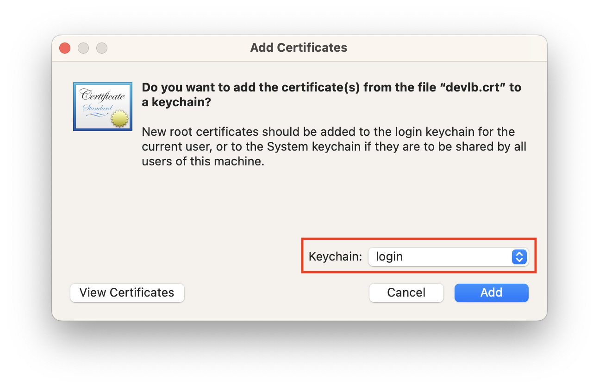
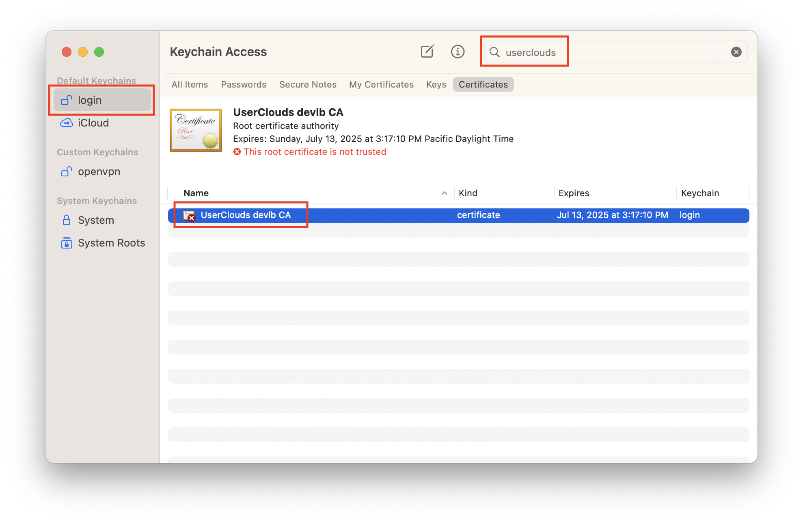
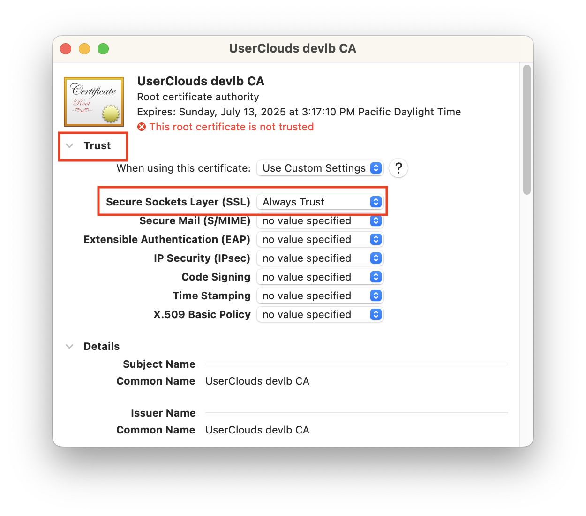

# UserClouds

[](https://coveralls.io/github/userclouds/userclouds?branch=master%0Astg/bugfix%0Astg/codegen%0Astg/cover)
[](https://betteruptime.com/?utm_source=status_badge)

This is the root of the UserClouds mono repo.

## Getting started

To start using this repo, you'll need a couple of utilities:

### homebrew

From the locally cloned UserClouds repo run the [tools/vendored-homebrew-install.sh](./tools/vendored-homebrew-install.sh) script:

```shell
# Install Homebrew.
./tools/vendored-homebrew-install.sh

# Make all shells source .bashrc. (this is because Mac Terminal has a non-Unix way of handling rc vs profile)
printf 'if [ -f ~/.bashrc ]; then\n  source ~/.bashrc\nfi' >> ~/.bash_profile

# Include Homebrew-managed binaries in your $PATH. (for ease of use)
echo 'export PATH="/usr/local/bin:/opt/homebrew/bin:$PATH"' >> ~/.bashrc
```

### Rosetta

On M1 Macs, macOS _should_ automatically install Rosetta when you attempt to run an Intel binary, unless you run it from the shell (in which case it will not prompt you). If you get a "bad CPU type in executable" error (e.g. when running CockroachDB), you'll need to install this manually once. See <https://apple.stackexchange.com/questions/408375/zsh-bad-cpu-type-in-executable>.

```shell
softwareupdate --install-rosetta
```

### git hooks

We use custom git hooks (in `tools/git`, and linked by the `install.sh` there that is also
run automatically for you in `make devsetup`) to run lint before committing, and tests before pushing

### git-lfs

For large file (asset) storage

```shell
brew update
brew install git-lfs

# you can ignore the error messages about git hooks, they're already set if you link as
# suggested in tools/git/README.md
git lfs install

# If your Unix & Userclouds usernames don't match, adjust $USER below
git config user.email "$USER@userclouds.com"
```

### [dir-env](https://direnv.net/)

To manage Bash profile args and go versions smartly

```shell
brew install direnv

# NOTE: Macs default to zsh - run
# echo $0
# to get your shell version.
# You can either run bash by running
# bash
# or change your default shell by running
# sudo chsh -s /bin/bash <username>

# The following line must stay at the end of .bashrc :
echo 'eval "$(direnv hook bash)"' >> ~/.bashrc
source ~/.bashrc

# NOTE: if you run zsh, you'll want to change this line to
# echo 'eval "$(direnv hook zsh)"' >> ~/.zshrc
#                            ^ (note the zsh instead of bash)

direnv allow # the first time you run this might take a while, like tens of minutes
```

If you use VSCode, you will want to install the [direnv extension](https://marketplace.visualstudio.com/items?itemName=mkhl.direnv) as well.

## Setup AWS Account for SSO

### Provision AWS Accounts via Google Workspace login as SSO

Go to <https://userclouds.awsapps.com/start#/> (login via your UserClouds Google Workspace if needed) - Then select the account named `UserClouds` (account number: #323439664763) and click `Management console` you will be redirect to the AWS Console dashboard/main page.
Once that is done, proceed to the next step needed to configure your local env (terminal/CLI) to use AWS SSO.

**[awscli](https://docs.aws.amazon.com/cli/latest/userguide/install-cliv2-mac.html)** is required for interoping with AWS (eg. accessing Secrets Manager in order to connect to prod DB for migration, etc).
That CLI is installed as part of `make devsetup`.
Normally, this is not required for local dev, however it is required for the initial setup of the dev environment (`make devsetup`) which downloads some credentials/secrets from AWS and stores them locally.

**_Before_ running `make devsetup` you will need to make sure you have a provisioned AWS account via SSO.**

You can set up an AWS account provisioned by IAM Identity Center via AWS SSO (using our Google Workspace login).
Account provisioning instructions are [in Notion](https://www.notion.so/userclouds/Provisioning-accounts-60695b7edbe1416cb2fa821e51b5ef70).)

Run the following command to setup AWS CLI configuration:

```shell
make configure-aws-cli
```

When you want to use the AWS CLI, run `aws sso login`, which will open a page for you to authenticate in your browser. This will generate a temporary auth token stored in `~/.aws/sso/cache/`, which is used by subsequent `aws` commands.

## Local setup

1. Follow the instructions below to install the SSL certificate
1. Run `make devsetup` to set up our system DBs for you, and accept all migrations to the most recent revision
1. Run `make devsetup-samples` to add sample data to our dbs
1. Run `make dev` to build all the services. If the build is successful, all the services start running and you will see the output logs. You may hit CTRL-C to exit, but you'll want to run this command again later to restart the services.

> We currently use 2 DBs: Cockroach DB (CDB) and Postgres. Both run on their default ports; 5432 for postgres and 26257 for CDB. By default, there is a user named `postgres` with no password as well as a default db named `postgres`. Running `psql postgres` connects to the default DB named postgres. No password is needed for CDB, since we use `--insecure`. Postgres does not seem to allow passwordless accounts besides the default.

## Development

Run `make dev`

or

Run `make services-dev` and run console or plex front end:

```
cd /console/consoleui
yarn run dev
```

## Installing the dev SSL certificate

We use a self-signed certificate to run the dev server, which you will need to trust on your machine.

Open [cert/devlb-CA.crt](cert/devlb-CA.crt) (NOT `devlb.crt`) with Keychain Access and add it to the `login` keychain.



Then, in the `login` keychain, double click the certificate, and select "Always Trust" for Secure Sockets Layer.





If you use Firefox, you'll also need to trust the certificate in Firefox's own CA store. In the Firefox preferences, Certificates section, click "View Certificates." In the Authorities tab, click "Import" and import `cert/devlb-CA.crt`.

## Set up your own admin account

Once everything is up and running (via `make dev`) open a browser window to <https://console.dev.userclouds.tools:3333>.
Click the link to create an account, and after your account is created, you will be taken to a page to create an company & tenant.
But rather than do that, you can grab the user ID at the bottom of that screen ([DEV] ID: {id}) and go back to your `bash` prompt
and run `tools/make-company-admin.sh dev {id}`. Then reload the website and you should be an admin for the UserClouds Dev company.

## Understanding our front-end

See [console/consoleui/README.md](https://github.com/userclouds/userclouds/blob/master/console/consoleui/README.md) for details on the Console, Plex and component library

## Troubleshooting

Some generic steps to check while debugging issues installing and running the app locally.

- Confirm `aws` is configured locally

  ```
  $ UC_UNIVERSE=debug tools/ensure-aws-auth.sh

  > AWS auth already valid
  ```

- Ensure the env is loaded

  ```
  $ direnv allow
  $ env | grep UC_CONFIG_DIR

  > UC_CONFIG_DIR=./config
  ```
